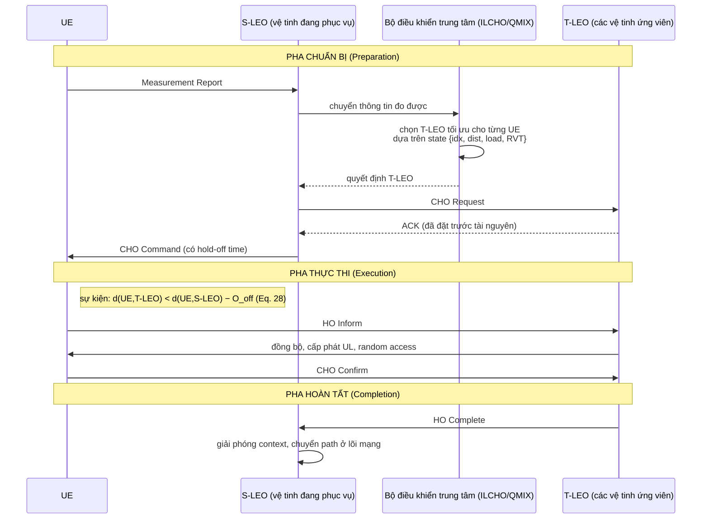
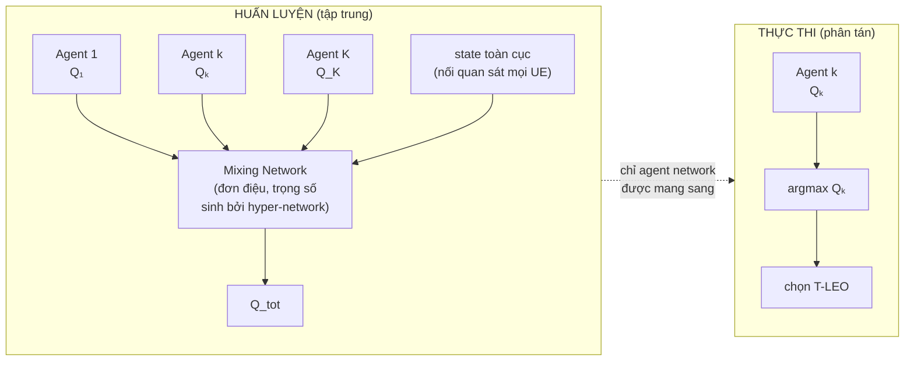
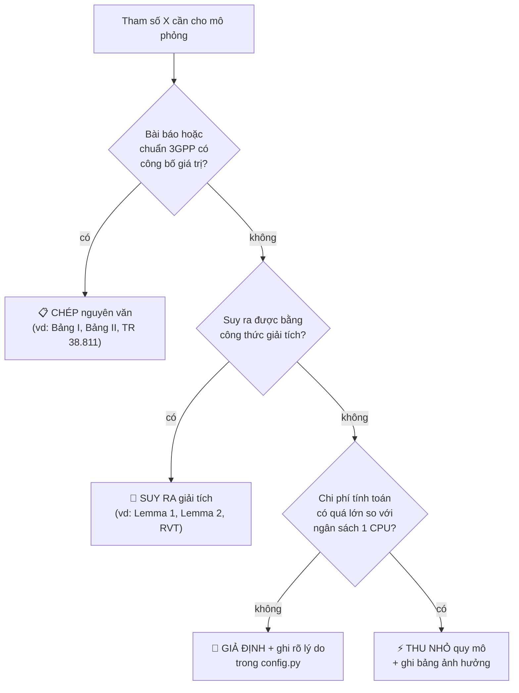
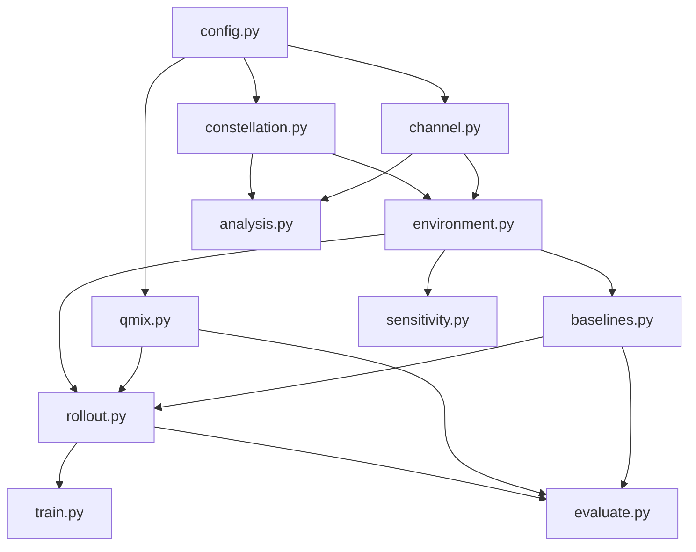
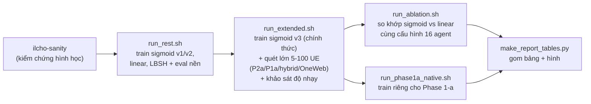

# Cách xây dựng lại (tái hiện) ILCHO từ bài báo — chi tiết kỹ thuật

Bài báo gốc: M. Choi, M. Park, J. Kim, J.-M. Chung, **"Intelligent Handover Scheme for
Improved 6G NTN LEO Satellite Network Performance,"** *IEEE Transactions on Mobile
Computing*, vol. 25, no. 5, May 2026, tr. 6863–6880.

Tài liệu này giải thích **từng quyết định kỹ thuật** khi dựng lại hệ thống ILCHO thành code
chạy được — vì sao chọn cách làm đó, dựa vào công thức/bảng nào trong bài báo, và khi bài
báo không nói rõ thì tôi chọn gì và tại sao. Xem thêm `docs/glossary` (bảng thuật ngữ trong
`METHODOLOGY.html` §2) nếu gặp từ chuyên ngành chưa quen.

---

## Mục lục

1. [Đọc hiểu bài báo — hệ thống ILCHO là gì](#1-đọc-hiểu-bài-báo--hệ-thống-ilcho-là-gì)
2. [Triết lý tái hiện: 4 nhóm quyết định cho mọi tham số](#2-triết-lý-tái-hiện-4-nhóm-quyết-định-cho-mọi-tham-số)
3. [Kiến trúc code](#3-kiến-trúc-code)
4. [Module `constellation.py` — Lemma 1 &amp; 2](#4-module-constellationpy--lemma-1--2)
5. [Module `channel.py` — link budget 3GPP](#5-module-channelpy--link-budget-3gpp)
6. [Module `environment.py` — môi trường CHO đa tác tử](#6-module-environmentpy--môi-trường-cho-đa-tác-tử)
7. [Module `qmix.py` — bộ điều khiển học tăng cường](#7-module-qmixpy--bộ-điều-khiển-học-tăng-cường)
8. [Module `baselines.py` — 4 phương pháp so sánh](#8-module-baselinespy--4-phương-pháp-so-sánh)
9. [Chiến lược kiểm thử](#9-chiến-lược-kiểm-thử)
10. [Vì sao chạy CPU, không dùng GPU](#10-vì-sao-chạy-cpu-không-dùng-gpu)
11. [Pipeline thực nghiệm](#11-pipeline-thực-nghiệm)

---

## 1. Đọc hiểu bài báo — hệ thống ILCHO là gì

**ILCHO = 3GPP Conditional Handover (CHO) + Multi-Agent Reinforcement Learning (QMIX)**,
dùng để chọn vệ tinh LEO đích cho từng UE trong một chòm vệ tinh mật độ cao.

### 1.1 Ba nền tảng giải tích (3 Lemma)

- **Lemma 1** — công thức toạ độ Cartesian của vệ tinh LEO tại thời điểm `t`, suy từ tham số
  quỹ đạo Walker-Delta (RAAN, độ nghiêng, phasing, bán trục lớn). Đây là chuyển động **hoàn
  toàn tất định** — biết tham số quỹ đạo là tính được vị trí ở bất kỳ thời điểm nào, không
  cần "dự đoán".
- **Lemma 2** — điều kiện để một vệ tinh "truy cập được" (accessible) với một UE: góc ngẩng
  (elevation angle) giữa UE và vệ tinh phải ≥ ψ_min = 30°. Từ đây suy ra `N_max` = số vệ
  tinh khả kiến tối đa tại một thời điểm — dùng làm **kích thước không gian hành động** của
  bài toán RL.
- **Lemma 3** — chứng minh bài toán chọn vệ tinh đích tối ưu cho nhiều UE cùng lúc là
  **NP-hard** (dạng generalized assignment problem biến thiên theo thời gian) → không giải
  chính xác được khi số UE/vệ tinh lớn, cần một phương pháp **học** (RL) thay vì tối ưu hoá
  cổ điển.

### 1.2 Quy trình CHO — 3 pha



**Điểm mấu chốt cần hiểu:** "trí tuệ" của ILCHO nằm ở **pha chuẩn bị** — quyết định chọn
T-LEO nào. Vì vị trí vệ tinh là tất định (Lemma 1), đây **không phải bài toán dự đoán** một
đại lượng bất định trong tương lai, mà là bài toán **ra quyết định tối ưu** dựa trên thông
tin đã biết trước. Sự kiện thực thi ở pha 2 mới là phần "phản ứng" theo thời gian thực,
dùng khoảng cách thay vì đo cường độ tín hiệu (RSRP) như handover truyền thống — vì tín hiệu
giữa các vệ tinh LEO dao động và không đáng tin cậy bằng khoảng cách hình học đã biết trước.

### 1.3 QMIX / CTDE — vì sao chọn thuật toán này

Mỗi UE là một **agent** quan sát cục bộ (không thấy toàn bộ hệ thống). Bài báo dùng **QMIX**
— một thuật toán MARL có 2 tính chất quan trọng:

- **CTDE (Centralized Training, Decentralized Execution):** lúc **huấn luyện**, một bộ điều
  khiển trung tâm (mô hình hoá near-RT RIC) thấy được thông tin toàn cục, dùng nó để huấn
  luyện tốt hơn qua một **mixing network**. Lúc **thực thi thật**, mỗi UE chỉ dùng mạng
  riêng của nó (agent network) và quan sát cục bộ — đúng với thực tế: vệ tinh/UE không thể
  chia sẻ toàn bộ trạng thái hệ thống theo thời gian thực.
- **Ràng buộc đơn điệu:** mixing network được ràng buộc sao cho hành động tốt nhất cho từng
  agent riêng lẻ cũng đồng thời là hành động tốt cho toàn hệ thống — tránh vấn đề "mỗi agent
  tối ưu cục bộ nhưng hại tổng thể".



**Hệ quả thiết kế quan trọng:** vì lúc thực thi không cần mixing network, số UE (K) lúc
**train** không nhất thiết phải bằng số UE lúc **eval**. Đây là lý do bản tái hiện train ở
12–16 agent nhưng vẫn eval được ở 5–100 UE (§7 dưới).

### 1.4 Hàm thưởng — vì sao phải là sigmoid

Khi một vệ tinh vừa "mọc" (bắt đầu truy cập được), nó có **RVT dài nhưng throughput thấp**
(ở xa, góc ngẩng nhỏ). Khi nó lên tới điểm gần nhất: throughput cao nhất, nhưng RVT đang cạn
dần. Nói cách khác: **throughput là hàm không đơn điệu theo thời gian** (tăng rồi giảm),
còn **RVT giảm đơn điệu**. Một hàm thưởng **tuyến tính** `w1·throughput + w2·RVT` không thể
diễn tả "điểm ngọt" giữa hai đại lượng có hình dạng khác nhau này — nó sẽ hoặc đánh giá thấp
một vệ tinh sắp đạt đỉnh throughput (vì RVT đang giảm), hoặc đánh giá cao một vệ tinh có
throughput tốt nhưng sắp rời khỏi tầm nhìn.

Hàm **sigmoid** `U(x) = c₃ / (1 + e^{c₁(x-c₂)})` tạo ra một "vùng thưởng cao" khi *cả hai*
đại lượng đều ở mức tốt, và phạt nhẹ dần ở hai cực — bài báo dùng thực nghiệm ablation
(so sigmoid với linear) để chứng minh điều này (Fig. 6 vs Fig. 7 trong bài báo).

### 1.5 Bốn phương pháp so sánh (baseline)

| Tên | Quy tắc chọn T-LEO | Điểm yếu mà ILCHO khắc phục |
|---|---|---|
| MD-CHO | vệ tinh **gần nhất** (Minimum Distance) | không quan tâm tải/RVT → nghẽn kênh khi đông UE |
| MVT-CHO | vệ tinh có **RVT dài nhất** (Maximum Visible Time) | không quan tâm throughput/tải |
| HSNF | gán tập trung theo mô hình luồng mạng (network flow), tối đa hoá throughput dưới ràng buộc kênh | tính toán tốn kém khi số vệ tinh lớn (mega-constellation); tạo nhiều HO không cần thiết |
| LBSH | multi-agent Q-learning (IQL) độc lập + thưởng cân bằng tải | không hội tụ ổn định khi không gian hành động lớn (nhiều vệ tinh) |

### 1.6 Chỉ số đánh giá

- **Số HO / số HOF** trung bình mỗi UE trong 1 lần phục vụ (600 s).
- **Spectral efficiency (SE)** trung bình — throughput chuẩn hoá theo băng thông (bps/Hz).
- **Jain's Fairness Index** — đo mức chia đều throughput giữa các UE.
- **Phương sai chiếm dụng kênh** `Var(L_m/J)` — đo mức cân bằng tải giữa các vệ tinh.

---

## 2. Triết lý tái hiện: 4 nhóm quyết định cho mọi tham số

Mọi con số/công thức trong code được xếp vào đúng 1 trong 4 nhóm sau — nguyên tắc phân loại
được áp dụng nhất quán cho toàn bộ dự án:



| Nhóm | Ký hiệu | Ví dụ |
|---|---|---|
| **CHÉP** từ bài báo/3GPP | 📋 | độ cao, độ nghiêng, số mặt phẳng quỹ đạo (Bảng I); E_EIRP, G/T, K_B, B_W, ψ_min, J, T_s (Bảng II); công thức path loss (TR 38.811 §6.6) |
| **SUY RA** giải tích | 🧮 | vị trí vệ tinh s_m(t) (Lemma 1); điều kiện truy cập + RVT (Lemma 2) |
| **GIẢ ĐỊNH** — bài báo không nói | 📝 | tần số sóng mang, `O_off` (Eq. 28), hằng số hàm thưởng `c1,c2,c3,p1,p2`, hệ số phasing Walker `F` |
| **THU NHỎ** quy mô | ⚡ | số episode/agent lúc train, `N_max` (16 thay vì 27), HSNF/LBSH là bản xấp xỉ |

Bảng đầy đủ, tham số theo tham số, nằm ở `REPORT.md` §8 (mục "Sai khác đã biết").

---

## 3. Kiến trúc code

```
src/ilcho/
  config.py         # dataclass tham số; mọi mục GIẢ ĐỊNH đều có chú thích nguồn ngay cạnh
  constellation.py  # Lemma 1 (vị trí vệ tinh), Lemma 2 (truy cập + RVT); hỗ trợ đa chòm sao
  channel.py        # link budget 3GPP, Eq. (8)-(13)
  environment.py    # môi trường CHO đa tác tử: sự kiện execution, hàm thưởng, các chỉ số
  qmix.py           # mạng DRQN + mixing network đơn điệu + hyper-network; learner (qmix|iql)
  baselines.py      # MD-CHO, MVT-CHO, HSNF (LBSH nằm trong qmix.py, mode="iql")
  rollout.py        # chạy 1 episode (khám phá / greedy / baseline)
  train.py          # vòng lặp huấn luyện + vẽ đường cong training
  evaluate.py        # quét số UE, đa seed, sinh hình dạng Fig. 8-11 của bài báo
  sensitivity.py    # khảo sát nhạy one-factor-at-a-time cho các tham số GIẢ ĐỊNH
  analysis.py       # tái hiện Fig. 5, phân bố khoảng cách giữa 2 lần HO, link budget theo góc ngẩng
  sanity.py         # kiểm chứng nhanh hình học + link budget so với con số bài báo
```



Không có vòng lặp phụ thuộc; `environment.py` là trung tâm — mọi kịch bản thực nghiệm khác
đều dùng lại nó thông qua `rollout.py`.

---

## 4. Module `constellation.py` — Lemma 1 & 2

### 4.1 Công thức vị trí vệ tinh (Eq. 1 của bài báo)

```
ψ  = Φ_m + ω·t + f₀            # Φ_m = 2π·h/N_L  (pha trong mặt phẳng)
Ω  = 2π·(v-1)/N_p              # RAAN — trải đều 360° vì đây là Walker-DELTA (không phải Walker-Star)
ω  = √(μ / a_s³)               # tốc độ góc trung bình; a_s = R_E + H_L (bán trục lớn)

x = a_s·(cosψ·cosΩ − sinψ·sinΩ·cosα)
y = a_s·(cosψ·sinΩ + sinψ·cosΩ·cosα)
z = a_s·(sinψ·sinα)
```

trong đó `α` là góc nghiêng quỹ đạo, `v` là chỉ số mặt phẳng quỹ đạo, `h` là chỉ số vệ tinh
trong mặt phẳng đó.

- 🧮 **Vector hoá:** toàn bộ `(T, M, 3)` vị trí (T mốc thời gian × M vệ tinh) được tính một
  lần bằng NumPy thay vì lặp từng vệ tinh/thời điểm. Với M = 5284 (Starlink Phase 2-a),
  T = 600, mảng kiểu `float32` chỉ tốn ~38 MB — chấp nhận được.
- 📝 **GIẢ ĐỊNH: bỏ qua xoay Trái Đất.** Cả UE và vệ tinh được đặt trong cùng một hệ quy
  chiếu quán tính (không quay theo Trái Đất). Bài báo cũng làm vậy — vì UE là VSAT cố định
  và tốc độ vệ tinh (7,59 km/s) vượt trội hẳn tốc độ quay của Trái Đất tại vĩ độ quan tâm.
  Trong 600 giây, Trái Đất chỉ xoay ~2,5° — sai số bậc nhỏ so với các nguồn sai số khác.
- 📋 **CHÉP:** độ lệch tâm quỹ đạo ε ≈ 0 (bài báo: Starlink có ε = 1,379×10⁻⁴, coi như tròn).

### 4.2 Điều kiện truy cập (Lemma 2) và RVT — thuật toán "duyệt ngược"

Điều kiện: `elevation(UE, sat) ≥ ψ_min = 30°` (Eq. 4-5 bài báo).

**RVT (Remaining Visible Time)** = số giây liên tục còn lại mà một vệ tinh vẫn còn truy cập
được đối với một UE, tính từ thời điểm hiện tại. Đây là chỗ cần một thuật toán khéo léo:

> **Vấn đề bộ nhớ:** cách tính ngây thơ là lưu toàn bộ ma trận truy cập `(T, K, M)` (bool)
> rồi `cumprod` theo thời gian. Với K=100 UE, M=5284 vệ tinh, T=600 mốc thời gian, ma trận
> này nặng **317 MB** chỉ để lưu bool — nếu tính RVT dạng số thực thì lên tới hàng GB. Không
> khả thi khi phải làm việc này hàng nghìn lần trong một phiên huấn luyện.

**Giải pháp — 2 lượt quét, chỉ giữ mảng nén `(T, K, N_max)`:**

```python
# LƯỢT XUÔI (mỗi mốc thời gian t):
#   tính khoảng cách + góc ngẩng của mọi UE tới mọi vệ tinh
#   lọc ra N_max vệ tinh TRUY CẬP ĐƯỢC gần nhất cho mỗi UE
#   lưu: sat_id[t,k,:], dist[t,k,:], se[t,k,:], mask[t,k,:]   (nhỏ, ~vài chục MB)

# LƯỢT NGƯỢC (t = T-1 lùi về 0):
#   rle_next = mảng (K, M) đếm số bước liên tục còn truy cập được, khởi tạo 0
#   rle_t = where(truy_cập_được[t], rle_next + 1, 0)
#   rvt[t, k, :] = rle_t[k, sat_id[t,k,:]] * dt      # chỉ lấy ra cho N_max ứng viên đã chọn
#   rle_next = rle_t
```

Nhờ vậy, bộ nhớ tụt từ hàng trăm MB xuống còn vài chục MB, mà kết quả **chính xác tuyệt đối**
(không xấp xỉ) — vì hình học là tất định, việc "nhìn trước tương lai" để tính RVT không phải
là dự đoán, mà là tính toán dựa trên ephemeris đã biết, đúng như bài báo giả định "near-RT
RIC tính trước accessibility từ dữ liệu ephemeris".

### 4.3 Vì sao `N_max = 16` mà không phải 27

Bài báo dùng `N_max` = 27 cho Phase 2-a — đây là **đỉnh số vệ tinh khả kiến trên MỌI vĩ độ**
(Fig. 5 của bài báo). Nhưng vùng mô phỏng cố định ở [39–41° N] (theo Bảng II), nơi đỉnh khả
kiến thực tế chỉ khoảng 15 (đã kiểm chứng bằng `ilcho-sanity`). Chọn `N_max = 16` giúp mạng
nơ-ron nhỏ hơn, huấn luyện nhanh hơn, mà vẫn đủ để bao phủ toàn bộ ứng viên thực tế trong
vùng — các ô hành động dư được **mask** (đánh dấu không hợp lệ) chứ không loại bỏ.

⚡ Đây là một lựa chọn **THU NHỎ**; đã kiểm tra bằng khảo sát độ nhạy rằng thay đổi các tham
số liên quan khác không làm đổi kết luận chính.

---

## 5. Module `channel.py` — link budget 3GPP

Cài đặt trực tiếp Eq. (8)–(13) của bài báo, dựa trên 3GPP TR 38.811/38.821:

```
FSPL     = 32,45 + 20·log₁₀(f_GHz) + 20·log₁₀(d_mét)        # Eq. (10)
P_LoS    = FSPL + shadow_fading_LoS + suy_hao_khí_quyển
P_NLoS   = FSPL + shadow_fading_NLoS + suy_hao_khí_quyển + clutter_loss
P_loss   = xác_suất_LoS · P_LoS + (1 − xác_suất_LoS) · P_NLoS   # Eq. (11), trộn tuyến tính (dB)
SNR_dB   = EIRP_tổng + G/T − (K_B + 10·log₁₀(B)) − P_loss        # Eq. (12)
SE       = log₂(1 + 10^(SNR_dB/10))    [bps/Hz]                 # Eq. (13), định lý Shannon
```

- 📋 **CHÉP:** `E_EIRP = -4 dBW/MHz`, `G/T = 15,9 dB/K`, `K_B = -228,6 dBW/K/Hz`,
  `B = 250 MHz`, bảng xác suất LoS theo góc ngẩng (rural, TR 38.811 Bảng 6.6.1-1), độ lệch
  chuẩn shadow fading (TR 38.811 Bảng 6.6.2-1) — tất cả lấy nguyên văn từ Bảng II bài báo và
  3GPP TR 38.811.
- 📝 **GIẢ ĐỊNH: tần số sóng mang = 20 GHz** (băng Ka đường xuống). Bài báo chỉ ghi "Ka-band"
  chứ không cho số cụ thể. **Cách hiệu chỉnh:** thử với 20 GHz, tính SE tại thiên đỉnh/340 km
  ra **3,78 bps/Hz** — khớp rất sát với con số bài báo công bố (≈3,76–3,85 bps/Hz), nên giữ
  giá trị này.
- 📝 **GIẢ ĐỊNH: E_EIRP là mật độ công suất** (đơn vị dBW/MHz), nên EIRP tổng cho cả kênh
  250 MHz = `-4 + 10·log₁₀(250) ≈ 19,98 dBW`. Đây là cách diễn giải hợp lý duy nhất cho đơn
  vị "dBW/MHz" khớp với công thức Eq. (12).

**Kiểm chứng:** ở góc ngẩng 30° (gần biên vùng phủ), SE tụt xuống chỉ còn ~1,7 bps/Hz — cho
thấy throughput trung bình mà một phương pháp đạt được **phụ thuộc rất nhiều vào việc chọn
được vệ tinh tốt** (gần thiên đỉnh) hay không — đúng thứ mà bộ điều khiển RL phải học để tối
ưu.

---

## 6. Module `environment.py` — môi trường CHO đa tác tử

### 6.1 Vector quan sát (state) — Eq. (26) của bài báo

Với mỗi UE, quan sát gồm thông tin của `N_max` vệ tinh khả kiến gần nhất, mỗi vệ tinh đóng
góp 5 con số:

```
[ chỉ_số_chuẩn_hoá, khoảng_cách_chuẩn_hoá, tải_kênh (L/J), RVT_chuẩn_hoá, cờ_đang_phục_vụ ]
```

- 📋 4 giá trị đầu lấy đúng theo Eq. (26) bài báo (`I, D, L, V`).
- 🧮 **Bổ sung của bản tái hiện:** cờ "đang phục vụ" (5ᵗʰ giá trị). Bài báo không liệt kê
  giá trị này trong công thức, nhưng nó **cần thiết về mặt logic**: agent phải tự biết vệ
  tinh nào đang phục vụ mình thì mới đánh giá được sự kiện thực thi (so sánh khoảng cách tới
  vệ tinh đích với khoảng cách tới vệ tinh đang phục vụ). Đây là một bổ sung tối thiểu, hợp
  lý, không thay đổi bản chất bài toán.

### 6.2 Vòng lặp một bước thời gian (1 giây)

```
1. Đọc hình học đã tính trước tại thời điểm t (sat_id, khoảng cách, SE, RVT, mask)
2. Mỗi agent (UE) chọn action a_k ∈ {0..N_max-1} → xác định "vệ tinh đích" (quyết định
   pha Chuẩn bị của CHO)
3. Xử lý từng UE theo THỨ TỰ NGẪU NHIÊN (đảm bảo công bằng khi tranh chấp kênh):
   a. nếu link đang phục vụ đột ngột mất mà UE chưa có đích khả dụng → "forced recovery",
      tính là 1 HOF, gắn tạm vào vệ tinh gần nhất còn trống kênh
   b. sự kiện thực thi (Eq. 28): d(UE, đích) < d(UE, đang phục vụ) − O_off, VÀ đã hết
      thời gian "guard" từ lần thử HO trước → tiến hành thử HO
   c. HOF nếu đích: đã mất truy cập | RVT ≤ 1 bước | hết kênh trống (load ≥ J)
   d. HO thành công: nhả kênh cũ, chiếm kênh đích, đặt lại đồng hồ guard, đếm +1 HO
4. Tính throughput giao được: SE của vệ tinh đang phục vụ (0 nếu không có kết nối hoặc
   đang trong cửa sổ "outage" sau HOF)
5. Tính reward theo Eq. (27) [sigmoid] hoặc Eq. (30) [linear]
```

### 6.3 Ba bổ sung quan trọng ngoài công thức gốc của bài báo

**(a) Thời gian "guard" sau mỗi lần thử HO — 📝 GIẢ ĐỊNH, 5 giây.**
Mô phỏng rời rạc từng giây: nếu không chặn, một UE thoả điều kiện thực thi sẽ **thử HO lại
mỗi giây** cho tới khi thành công hoặc điều kiện không còn đúng — khi kênh đang tranh chấp,
một UE có thể sinh ra hàng chục HOF liên tiếp chỉ trong 1 phút, điều này phi thực tế. Guard
5 giây mô phỏng khoảng thời gian "time-to-trigger + độ trễ thực thi" mà chính bài báo có nhắc
tới ("có một khoảng trễ trước pha thực thi để T-LEO đặt trước tài nguyên"). Đã khảo sát độ
nhạy với guard ∈ {0, 2, 5, 10, 20} giây — kết luận không đổi (xem `REPORT.md` §6).

**(b) Cửa sổ "outage" 2 giây sau mỗi HOF — 📝 GIẢ ĐỊNH.**
Ban đầu, khi một baseline (MD/MVT) bị HOF, UE vẫn bám vệ tinh cũ nên **throughput không hề
giảm** — chỉ tăng biến đếm HOF. Nhưng trong thực tế, một lần chuyển giao thất bại nghĩa là
**mất kết nối vô tuyến (radio link failure) rồi phải tái thiết lập** — tốn vài giây không
truyền được dữ liệu. Bản tái hiện thêm cửa sổ outage (SE = 0) trong 2 giây sau mỗi HOF. Nhờ
vậy, throughput *giao được* của các phương pháp hay HOF (MD-CHO ở 40+ UE mất tới 21% thời
gian không có dịch vụ) tụt xuống đúng như xu hướng trong Fig. 8c bài báo — ILCHO thắng về
throughput không phải vì được ưu ái, mà vì nó gần như không bao giờ HOF.

**(c) Diễn giải lại dấu trong Eq. (27) — mâu thuẫn trong bài báo gốc.**
Nguyên văn bài báo viết phần thưởng ổn định (không HO/HOF) là `-U_R + U_RVT`, nhưng đồng
thời khẳng định bằng lời "throughput cao hơn → reward cao hơn". Nếu `U_R` được định nghĩa
tăng theo throughput (như phần lời văn mô tả các hằng số `c1<0, c2>0, c3>0`), thì
`-U_R` lại **giảm** khi throughput tăng — mâu thuẫn nội tại. Bản tái hiện bám theo **ý định
trong lời văn** thay vì công thức viết tay có thể bị lỗi in ấn:

```
reward_ổn_định = U_R(throughput) + U_RVT(RVT)
  U_R:   tăng theo throughput, miền giá trị (0, c₃)       — throughput cao → thưởng cao
  U_RVT: tiến về 0 khi RVT lớn, phạt mạnh khi RVT nhỏ      — RVT thấp → bị phạt
```

Lựa chọn này được ghi rõ trong docstring hàm `_reward()` của `environment.py`.

### 6.4 Câu chuyện tinh chỉnh hằng số hàm thưởng — 3 phiên bản

| Phiên bản | Hằng số chính | Quan sát khi huấn luyện | Bài học rút ra |
|---|---|---|---|
| v1 | `se_c2=2,5`, `rvt_c2=60`, `p1=1` | Điểm thưởng tụt mạnh liên tục — vì các lượt bay ở 340 km ngắn, RVT hầu như luôn < 60 s nên gần như mọi bước đều bị phạt RVT | `rvt_c2` đặt quá lớn so với thực tế hình học |
| v2 | `se_c2=3,3`, `se_c1=-1,75`, `rvt_c2=18`, `p1=1` | HOF giảm về ~0,1 (rất tốt) nhưng SE tụt từ 3,30 xuống 2,97 — đánh đổi throughput lấy sự ổn định | gradient của nhánh throughput quá yếu so với hình phạt HO/HOF |
| **v3** (dùng chính thức) | `se_c3=2,0`, `se_c2=3,0`, `se_c1=-2,0`, `p1=0,5` | HOF giảm 2,30→0,19, **SE giữ ở mức 3,26→3,13** (không còn tụt như v2) | tăng gấp đôi trọng số nhánh throughput để cân bằng lại với hình phạt |

Ba phiên bản này được **giữ lại cả ba** để so sánh — bản thân đây là một khảo sát ablation
mở rộng ngoài phạm vi bài báo, và là minh chứng cho thấy **việc chọn hằng số hàm thưởng
(mà bài báo không công bố) ảnh hưởng thực sự tới kết quả cuối cùng.**

---

## 7. Module `qmix.py` — bộ điều khiển học tăng cường

- 📋 **CHÉP kiến trúc:** mạng agent = FC → GRUCell → FC (DRQN); mixing network dùng
  hyper-network sinh trọng số `|W|` (giá trị tuyệt đối, đảm bảo tính đơn điệu) từ state toàn
  cục, kích hoạt ELU; target network cập nhật kiểu "soft update" với `τ = 10⁻³`; discount
  `γ = 0,99`; learning rate `10⁻⁴`; batch 32 episode — toàn bộ lấy từ Bảng II ("Hyper-
  Parameters of ILCHO") của bài báo.
- 🧮 **CTDE là chìa khoá cho phép train ít, eval nhiều agent hơn:** vì mixing network chỉ
  dùng lúc huấn luyện, và lúc eval chỉ cần mạng agent (dùng chung trọng số cho mọi UE), số
  UE khi eval (5 đến 100) **không cần bằng** số agent lúc train (12–16). Đây là lý do kỹ
  thuật quan trọng nhất giúp bản tái hiện khả thi trên 1 CPU — nếu không có CTDE, train một
  mạng riêng cho từng số UE sẽ tốn gấp hàng chục lần thời gian.
- 🧮 **Dùng lại chính bộ mã để cài LBSH:** đặt `mode="iql"` sẽ bỏ mixing network, mỗi agent
  học TD-error trên phần thưởng riêng của mình (Independent Q-Learning) — đúng cơ chế của
  baseline LBSH trong bài báo (multi-agent Q-learning độc lập + thưởng cân bằng tải).
- 🧮 **Replay buffer theo đơn vị episode** (không phải từng bước rời rạc) — vì mạng agent có
  thành phần hồi quy (GRU), cần chuỗi thời gian liên tục để lan truyền ngược đúng.

---

## 8. Module `baselines.py` — 4 phương pháp so sánh

- 📋 **MD-CHO, MVT-CHO:** cài đặt đúng định nghĩa của bài báo — đọc trực tiếp từ vector quan
  sát (chọn ô có khoảng cách nhỏ nhất / RVT lớn nhất trong các ô hợp lệ).
- ⚡ **HSNF (xấp xỉ):** bài báo dùng mô hình luồng mạng (network flow) trên đồ thị đầy đủ.
  Bản tái hiện xấp xỉ bằng **gán tham lam theo capacity**: xếp mọi cặp (UE, vệ tinh ứng viên)
  theo spectral efficiency giảm dần, gán tuần tự nếu UE chưa có vệ tinh và vệ tinh còn kênh
  trống. Đủ để tái hiện xu hướng định tính ("HSNF ổn định, HOF thấp nhờ biết trước capacity,
  nhưng tốn tính toán và tạo nhiều HO không cần thiết") nhưng **không phải cài đặt đầy đủ**
  thuật toán gốc — xem `KE_HOACH_TAI_TAO_DAY_DU.md` bước 3 để biết cách nâng cấp.
- ⚡ **LBSH (xấp xỉ):** IQL (dùng lại `qmix.py` với `mode="iql"`) + phần thưởng kết hợp
  cân bằng tải và RVT, phạt nặng mỗi lần HO. Không phải cài đặt đầy đủ theo bài tham chiếu
  gốc — kết quả cho thấy bản xấp xỉ này **ổn định hơn** mô tả trong bài báo (không "vỡ trận"
  ở tải cao), nên số liệu tuyệt đối của LBSH kém tin cậy hơn các phương pháp khác.

---

## 9. Chiến lược kiểm thử

Ba tầng, từ rẻ tới đắt — **mỗi tầng phải qua mới sang tầng tiếp theo:**

1. **Sanity** (`uv run ilcho-sanity`, dưới 10 giây) — so hình học + link budget với con số
   bài báo *trước khi* viết môi trường RL, để chắc chắn nền tảng toán học đúng trước khi xây
   thêm lên trên.
2. **Smoke** (~1 phút) — chạy 1 episode ngắn cho mỗi baseline, và ~40 episode QMIX để bắt lỗi
   hình dạng tensor/logic trước khi tốn hàng giờ huấn luyện thật.
3. **Full** — huấn luyện đầy đủ + quét đa seed + khảo sát độ nhạy + phân tích.

### Các mốc kiểm chứng định lượng đã đạt được

| Đại lượng | Bài báo | Bản tái hiện | Kết luận |
|---|---|---|---|
| Đỉnh vệ tinh khả kiến, Phase 1-a | 17 | **17** | khớp chính xác |
| Đỉnh vệ tinh khả kiến, Phase 2-a | 27 | 29 | lệch ~7%, do hệ số phasing F không công bố |
| SE ở thiên đỉnh, 340 km | ≈3,76–3,85 bps/Hz | **3,78** | khớp |
| Khoảng thời gian tối thiểu giữa 2 HO | 6,61 s (giới hạn lý thuyết) | **8,0 s** (đo thực nghiệm) | khớp sát |

Chi tiết đầy đủ + toàn bộ số liệu cuối cùng: xem `REPORT.md`.

---

## 10. Vì sao chạy CPU, không dùng GPU

Máy có GPU (GTX 1650 Ti) nhưng bản tái hiện cố ý chạy CPU:

1. **Mạng quá nhỏ.** Agent network chỉ là FC(80→64)→GRUCell(64)→FC(64→16), với 12–16 agent.
   Chi phí copy dữ liệu CPU↔GPU và khởi động kernel tính toán thường **lớn hơn** chính phép
   tính — GPU chỉ thật sự lợi khi tensor đủ lớn (batch hàng nghìn, hidden layer hàng nghìn).
2. **Vòng lặp GRU tuần tự 300 bước.** Bước thời gian `t` phụ thuộc kết quả của bước `t-1`,
   không song song hoá được — đây là bài toán **bị giới hạn bởi độ trễ (latency-bound)**,
   đúng loại việc GPU làm kém nhất.
3. **Nút thắt thật sự nằm ở NumPy, không phải mạng nơ-ron.** Phần tốn thời gian nhất mỗi
   episode là tính hình học (`build_episode_geometry`): vị trí hàng nghìn vệ tinh × hàng
   trăm mốc thời gian, ma trận truy cập, RVT — tất cả chạy trên CPU dù có GPU hay không.
4. **Đơn giản hoá môi trường cài đặt.** PyTorch bản CUDA cần khớp đúng driver/runtime CUDA
   của máy; dùng CPU giúp `uv sync` chạy được ngay trên bất kỳ máy Windows nào mà không cần
   cấu hình thêm.

→ Hướng tăng tốc đúng đắn là **vector hoá phần môi trường** (xem
`KE_HOACH_TAI_TAO_DAY_DU.md` bước 1), không phải chuyển sang GPU.

---

## 11. Pipeline thực nghiệm



Mỗi script tự chờ tiền đề của mình (file policy đã lưu xong) rồi mới chạy — có thể dừng giữa
chừng mà vẫn giữ được toàn bộ dữ liệu đã sinh ra (`results.json` được ghi ngay sau mỗi bước
quét, không đợi tới cuối toàn bộ pipeline).

**Lệnh chạy lại đầy đủ:**

```bash
uv sync
uv run ilcho-sanity
bash scripts/run_rest.sh
bash scripts/run_extended.sh
bash scripts/run_ablation.sh
bash scripts/run_phase1a_native.sh
uv run python scripts/make_report_tables.py
```

Kết quả số liệu cuối cùng, phân tích, và so sánh chi tiết với bài báo: xem `REPORT.md`.
Lộ trình để tiến gần hơn nữa tới quy mô đầy đủ của bài báo: xem
`KE_HOACH_TAI_TAO_DAY_DU.md`.
