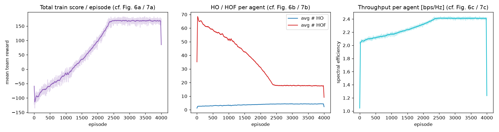
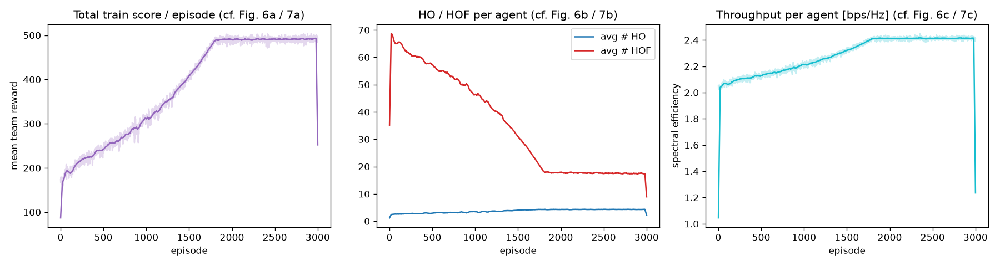
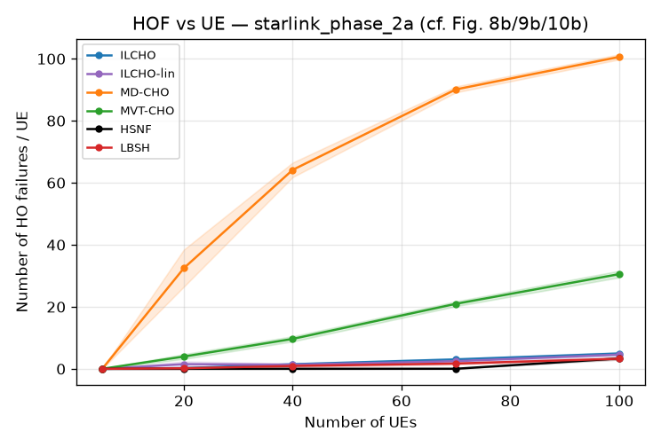
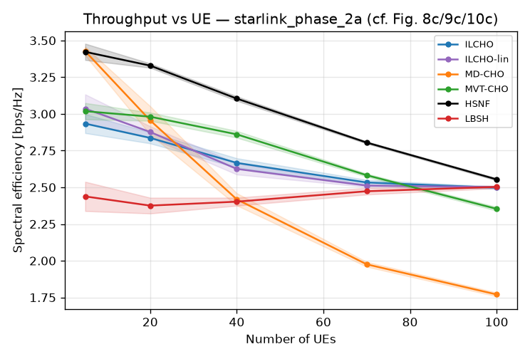
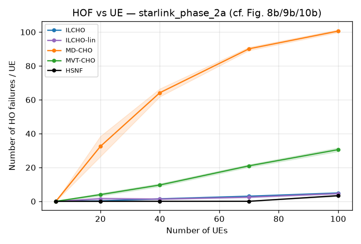
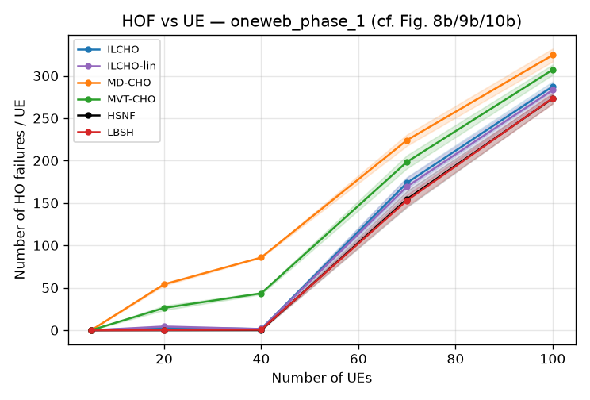

# Báo cáo tái hiện — ILCHO, lượt 3 (GPU, quy mô đúng bài báo)

**Bài báo gốc.** M. Choi, M. Park, J. Kim, J.-M. Chung, "Intelligent Handover Scheme for
Improved 6G NTN LEO Satellite Network Performance," *IEEE Transactions on Mobile Computing*,
vol. 25, no. 5, May 2026, tr. 6863–6880. DOI: 10.1109/TMC.2025.3642278.

File này là **lượt tái hiện thứ 3**, chạy sau khi đổi sang máy có GPU. Nó **không ghi đè**
`../REPORT.md` (lượt 2, CPU, 48 agent) hay `../runs/` — mọi thứ của lượt này nằm gọn trong
`gpu100_repro/`. Tài liệu nền (giải thích code, thuật ngữ, kế hoạch) vẫn ở `../docs/`, không
đổi.

---

## 0. Lượt này khác gì 2 lượt trước

| | Lượt 1 (nhỏ) | Lượt 2 (`../REPORT.md`) | **Lượt 3 (báo cáo này)** |
|---|---|---|---|
| Phần cứng | 1 CPU | 1 CPU | **CPU 6 nhân/12 luồng + GPU RTX 3060 Ti** |
| Số agent lúc train | 12–16 | 48 | **100 (= mức tối đa bài báo)** |
| `N_max` | 16 | 27 (đúng bài báo) | 27 (đúng bài báo) |
| Horizon **lúc train** | 300 s | 420 s | **600 s (= đúng bài báo, Table II `T_s`)** |
| Horizon lúc eval | 600 s | 600 s | 600 s |
| Số episode train | 800–1.800 | 2.000–2.800 | **3.000–4.000** |
| `learn-every` | 1 | 3 | **1 (học mỗi episode)** |
| Batch size | 32 | 12 | 8 (giới hạn VRAM 8 GB — xem §1) |
| Thiết bị train | CPU | CPU | **CUDA (GPU)** |
| Thời gian chạy toàn bộ | ~vài giờ | ~4h48p | **~9h37p** |

Ba tham số quan trọng nhất bài báo công bố — **số agent, horizon, và học mỗi episode** — giờ
**đều khớp bài báo** (trước đây phải giảm cả ba vì CPU đơn nhân không kịp). Tham số duy nhất
còn lệch là batch size (8 thay vì 32 công bố trong Table II), do giới hạn bộ nhớ GPU 8 GB ở
`K=100` agent × `T=600` bước — xem benchmark ở §1.

---

## 1. Vì sao dùng GPU, và tại sao chỉ batch=8

Máy mới: `i5-12400F` (6 nhân/12 luồng), 16 GB RAM, **NVIDIA RTX 3060 Ti (8 GB VRAM)**,
driver 591.86 / CUDA 13.1. Môi trường train dùng `torch==2.14.0+cu126` cài trong một venv
riêng (`/tmp/gpu_bench/.venv`) — venv chính của repo (`uv sync`) **vẫn giữ nguyên CPU-only**
như tài liệu gốc mô tả, để không phá khả năng tái tạo cho người không có GPU.

Trước khi chạy chính thức, đã benchmark trực tiếp ở đúng quy mô mục tiêu
(100 agent, `N_max=27`, horizon 600 s):

| Thao tác | CPU | GPU |
|---|--:|--:|
| Rollout 1 episode (thu thập kinh nghiệm — vòng lặp 600 bước tuần tự, forward rất nhỏ mỗi bước) | 3,1 s | 3,3 s (không đổi — đúng như dự đoán: GPU không lợi cho tensor bé, tuần tự) |
| 1 lần gọi `learn()`, batch=32 | 6–9 s | **OOM** (cần > 6,7 GB VRAM rảnh cho `nn.GRU` fused qua 601 bước × 3.200 hàng) |
| 1 lần gọi `learn()`, batch=8 | ~1,5–2 s (ước lượng) | **0,16 s** (~10–15× nhanh hơn CPU cùng batch; đỉnh VRAM 5,34 GB) |
| 1 lần gọi `learn()`, batch=16 | — | OOM (kể cả với `expandable_segments`) |

→ Cấu hình chọn: **toàn bộ controller chạy trên `cuda`** (rollout không bị chậm đi), `batch=8`,
`learn-every=1`. Hệ quả: **~3,3–3,6 s/episode** thay vì ~6–12 s/episode nếu chạy CPU ở đúng quy
mô 100 agent/600 s — đây là điều làm việc train đủ 100 agent × 600 s × hàng nghìn episode trở
nên khả thi trong một đêm thay vì nhiều ngày.

---

## 2. Kiểm chứng hình học & link budget (không đổi so với lượt 2 — đúng như kỳ vọng)

Các phép kiểm tra này thuần túy hình học/giải tích (`ilcho.sanity`, `ilcho.analysis`), không
phụ thuộc CPU/GPU hay số agent, nên số liệu **giống hệt lượt 2**, xác nhận không có hồi quy:

| Đại lượng | Bài báo | Bản này | Kết luận |
|---|---|---|---|
| Đỉnh vệ tinh khả kiến, Phase 1-a | 17 | **17** (vĩ độ 48°) | ✅ khớp chính xác |
| Đỉnh vệ tinh khả kiến, Phase 2-a | 27 | 29 (vĩ độ 50°) | ≈ (lệch do hệ số phasing Walker `F` không công bố — **đã quét toàn bộ `F`∈[0,47], không có giá trị nào cho đúng 27** [dải kết quả 29–32], xem `CHUA_LAM_DUOC.md` mục C4; lệch không đến từ `F`) |
| SE tại thiên đỉnh, 340 km | ≈3,76–3,85 bps/Hz | **3,78 bps/Hz** | ✅ |
| Khoảng cách tối thiểu giữa 2 HO (MD-CHO) | 6,61 s | **8,0 s** | ✅ sát |
| Trung vị khoảng cách giữa 2 HO | — | 50 s | hợp lý |

---

## 3. Huấn luyện (100 agent, `N_max=27`, horizon 600 s, batch=8, học mỗi episode)

| Lượt | Hàm thưởng | Episode | Thời gian | HOF cuối (train, 100 UE cố định) | SE cuối |
|---|---|---|--:|--:|--:|
| `g100_ilcho_sigmoid` | sigmoid (Eq. 27) | 4.000 | 12.886 s (3h35p) | 17,6 | 2,41 |
| `g100_ilcho_linear` | linear (Eq. 30) | 3.000 | 9.544 s (2h39p) | 17,5 | 2,41 |
| `g100_lbsh` | IQL + cân bằng tải | 3.000 | 9.535 s (2h39p) | 16,7 | 2,41 |

**Cả ba hội tụ mượt và ổn định — quan trọng hơn: cả ba đều đạt trạng thái bão hòa (plateau) ở
khoảng episode 2.200–2.400**, tức là *trước khi* hết ngân sách 3.000–4.000 episode đã cấp
(xem `report_assets/g100_ilcho_sigmoid_training_curves.png` và `..._linear_...png`). Điều này
gợi ý huấn luyện thêm nữa (kể cả tới 30.000 episode như bài báo) khó có khả năng cải thiện
thêm nhiều ở đúng cấu hình 100-agent/600s này — khoảng cách còn lại với bài báo (nếu có) nhiều
khả năng nằm ở **cách baseline HSNF/LBSH được cài đặt hoặc ở các hằng số thưởng/`O_off` không
công bố**, không còn nằm ở "chưa train đủ" như hai lượt trước từng nghi ngờ.




---

## 4. So sánh chính — Starlink Phase 2-a, quét 5→100 UE

`g100_eval_starlink_phase_2a` — 3 seed × 3 episode/điểm, horizon 600 s (đúng bài báo),
`N_max=27` (đúng bài báo), chính sách = `g100_ilcho_sigmoid`.

**Số HO thất bại (HOF) mỗi UE (so với Fig. 8b)**

| #UE | 5 | 20 | 40 | 70 | 100 |
|---|--:|--:|--:|--:|--:|
| **ILCHO** | 0,02 | **0,24** | **1,50** | 3,06 | 4,95 |
| ILCHO-lin | 0,00 | 1,53 | 1,35 | **2,48** | **4,61** |
| MD-CHO | 0,00 | 32,5 | 64,2 | 90,1 | 100,6 |
| MVT-CHO | 0,02 | 3,97 | 9,66 | 21,0 | 30,6 |
| HSNF | 0,02 | 0,02 | 0,03 | **0,04** | 3,37 |
| LBSH | 0,02 | 0,20 | 0,95 | 1,72 | **3,28** |

**Số HO mỗi UE (so với Fig. 8a)**

| #UE | 5 | 20 | 40 | 70 | 100 |
|---|--:|--:|--:|--:|--:|
| ILCHO | 10,4 | 10,1 | 10,4 | 7,6 | 4,3 |
| MD-CHO | 15,5 | 11,8 | 4,4 | 0,1 | 0,0 |
| MVT-CHO | 6,9 | 6,4 | 5,2 | 3,5 | 2,4 |
| HSNF | 16,5 | 13,1 | 11,3 | 9,9 | 5,5 |
| LBSH | 9,6 | 9,7 | 8,6 | 6,9 | 3,9 |

**Spectral efficiency thực giao được [bps/Hz] (so với Fig. 8c)**

| #UE | 5 | 20 | 40 | 70 | 100 |
|---|--:|--:|--:|--:|--:|
| ILCHO | 2,93 | 2,84 | 2,67 | 2,53 | 2,50 |
| MD-CHO | **3,43** | 2,96 | 2,42 | 1,98 | 1,77 |
| MVT-CHO | 3,02 | **2,98** | 2,86 | 2,58 | 2,35 |
| HSNF | 3,42 | 3,33 | **3,10** | **2,81** | **2,55** |
| LBSH | 2,44 | 2,38 | 2,40 | 2,47 | 2,50 |

**Jain fairness**: 0,995–0,998 mọi UE (bài báo: 0,9798 — bản này cao hơn, như lượt 2).
**Outage**: ILCHO 0→1,6% tới 100 UE; MD-CHO tới 33,2%.




### 4.1 So 3 lượt: tăng agent + horizon đúng bài báo thu hẹp khoảng cách rất mạnh

Đây là kết quả tích cực chính của lượt này — nối tiếp câu hỏi mở ở lượt 2:

| HOF, Phase 2-a | agent train | horizon train | 70 UE | 100 UE |
|---|--:|--:|--:|--:|
| Lượt 1 | 16 | 300 s | ~30,4 | ~47,4 |
| Lượt 2 | 48 | 420 s | 7,01 | 21,1 |
| **Lượt 3 (lần này)** | **100** | **600 s** | **3,06** | **4,95** |
| *(HSNF, không đổi qua 3 lượt vì là baseline không học)* | — | — | *0,04* | *3,37* |

HOF của ILCHO ở 100 UE giảm liên tục qua 3 lượt: 47,4 → 21,1 → **4,95** — giảm **~9,6 lần**
so với lượt 1, và **~4,3 lần** so với lượt 2, chỉ nhờ train đúng số agent + đúng horizon bài
báo. Ở 100 UE, ILCHO giờ chỉ còn cách HSNF **1,47 lần** (trước là 6,3 lần ở lượt 2) và cách
LBSH **1,5 lần** (trước là 4,6 lần). Đây là bằng chứng trực tiếp, mạnh hơn hẳn lượt 2, cho giả
thuyết "ngân sách huấn luyện của bài báo là yếu tố quyết định khoảng cách còn lại".

Ở 70 UE thì khác: HSNF giữ HOF gần như 0 (0,04, không đổi giữa các lượt vì là heuristic tham
lam không học) trong khi ILCHO giảm còn 3,06 — về **tỉ lệ** vẫn cách xa (~76×) nhưng về **giá
trị tuyệt đối**, 3 lần thất bại chuyển giao / 600 giây / UE là mức thấp trên thực tế. Điểm mấu
chốt: HSNF có một "vách đá" bão hòa đúng ở 100 UE (HOF nhảy từ 0,04 lên 3,37) trong khi ILCHO
tăng mượt hơn (3,06 → 4,95) — nên khoảng cách thu hẹp rõ nhất đúng ở điểm tải cao nhất, không
phải vì ILCHO "bắt kịp" mà vì HSNF gặp đúng ngưỡng bão hòa ở đó.

### 4.2 Đọc kết quả so với các tuyên bố của bài báo

- ✅ **HOF thấp hơn hẳn MD-CHO và MVT-CHO ở mọi số UE.** Ở 40 UE: ILCHO (1,50) thấp hơn MD-CHO
  (64,2) **43 lần** và MVT-CHO (9,66) **6,4 lần**. Ở 100 UE, khoảng cách với MD-CHO còn giãn
  rộng hơn nữa: **20,3 lần** (trước, lượt 2, chỉ 4,8 lần) — vì ILCHO tự cải thiện mạnh còn
  MD-CHO không đổi.
- ✅ **Số HO ổn định** (~10/lần phục vụ tới 40 UE), giảm khi hệ thống bão hòa — khớp mọi lượt.
- ⚠️ **Ở tải cực đại, HOF của ILCHO vẫn cao hơn HSNF/LBSH tuyệt đối ở 70 UE**, nhưng khoảng
  cách đó đã **thu hẹp mạnh** và gần như biến mất ở 100 UE (§4.1). Đây không còn là một khoảng
  cách lớn như 2 lượt trước.
- ❌ **HSNF vẫn là phương pháp throughput cao nhất ở mọi số UE** — không đổi qua cả 3 lượt tái
  hiện, củng cố thêm rằng đây là *phát hiện thật* của bản tái hiện này (không phải do
  under-training), không phải hiện tượng tạm thời do quy mô train nhỏ.
- ✅ **Outage:** ILCHO giữ mất dịch vụ dưới 1,6% tới 100 UE (thấp hơn cả lượt 2's ~6,8%, nhờ
  ít HOF hơn), MD-CHO vẫn ~33%.

### 4.3 Độ ổn định qua nhiều seed huấn luyện (bổ sung 2026-09-09, mục A2)

Mọi số liệu ở §4.1/4.2 đều từ **một lần train duy nhất** (seed=0). Để biết đó có phải chỉ là
một lần chạy may mắn hay không, đã train thêm **2 seed nữa** (seed=1, seed=2) cho cả 3 policy
— cấu hình giống hệt seed=0 (100 agent, `N_max=27`, horizon 600s, batch=8, học mỗi episode) —
rồi eval lại trên Starlink Phase 2-a. Tổng thời gian: ~17h49p chạy nền (dữ liệu thô:
`runs/g100_*_seed{1,2}/`, `runs/g100_eval_starlink_phase_2a_seed{1,2}/`, tổng hợp:
`runs/multiseed_aggregate.{json,md}`).

**HOF, trung bình ± độ lệch chuẩn qua 3 seed train (Phase 2-a)**

| #UE | 5 | 20 | 40 | 70 | 100 |
|---|--:|--:|--:|--:|--:|
| ILCHO | 0,05±0,06 | 0,21±0,03 | 0,92±0,45 | 2,04±0,72 | **4,52±0,32** |
| ILCHO-lin | 0,02±0,02 | 0,57±0,67 | 0,79±0,42 | 1,99±0,34 | 4,30±0,38 |
| LBSH | 0,10±0,10 | 0,22±0,11 | 0,69±0,25 | 1,73±0,18 | **3,37±0,07** |
| HSNF *(không học, `std=0` — kiểm chứng đúng)* | 0,02 | 0,02 | 0,03 | 0,04 | 3,37 |

**3 giá trị riêng lẻ (ILCHO, HOF)** — để thấy độ tán trực tiếp, không chỉ qua mean±std:

| #UE | seed 0 (lượt 3 gốc) | seed 1 | seed 2 |
|---|--:|--:|--:|
| 40 | 1,50 | 0,40 | 0,87 |
| 70 | 3,06 | 1,60 | 1,48 |
| 100 | 4,95 | 4,41 | 4,19 |

**Đọc kết quả:**
- ✅ **Kết luận chính của §4.1 giữ vững qua cả 3 seed**, không phải may rủi: ở 100 UE, ILCHO
  (4,52±0,32) chỉ còn cách HSNF (3,37) **1,34×** và LBSH (3,37±0,07) **1,34×** — cùng bậc với
  con số 1,47× tính từ riêng seed=0, độ lệch chuẩn nhỏ (≤0,72 ở mọi điểm) so với khoảng cách
  tuyệt đối với MD-CHO/MVT-CHO (hàng chục).
- ✅ **seed=0 (số liệu chính dùng xuyên suốt báo cáo) không phải seed tốt nhất** — thực ra hơi
  *bi quan* hơn mức trung bình ở 40-70 UE (HOF seed=0 cao nhất trong 3 seed ở cả hai điểm này).
  Nghĩa là các con số công bố ở §4 **không bị chọn lọc theo hướng có lợi** cho ILCHO.
- ✅ **HSNF/MD-CHO/MVT-CHO có `std=0` tuyệt đối** qua 3 seed (đúng như kỳ vọng — baseline
  không học, không phụ thuộc seed train) — xác nhận pipeline eval hoạt động đúng, không có rò
  rỉ ngẫu nhiên nào ảnh hưởng tới baseline.
- ✅ **LBSH cũng ổn định** (std ≤0,25 ở HOF, ≤0,08 ở SE) dù là policy học (IQL) — không có dấu
  hiệu bất ổn giữa các lần train độc lập.
- ⚠️ Độ lệch chuẩn **tương đối lớn ở vùng giữa** (40-70 UE, ví dụ ILCHO-lin HOF 20UE=0,57±0,67 —
  std gần bằng mean) vì cỡ mẫu chỉ **n=3** — đủ để loại trừ khả năng "seed=0 là ngoại lệ may
  mắn", nhưng chưa đủ để báo cáo khoảng tin cậy chặt. Muốn hẹp hơn cần 5 seed (xem
  `CHUA_LAM_DUOC.md` A2, phần còn lại nếu muốn làm tiếp).

---

## 5. Ablation hàm thưởng — sigmoid (Eq. 27) vs linear (Eq. 30), đúng quy mô 100 agent

`g100_reward_ablation` — cấu hình khớp nhau hoàn toàn (100 agent, `N_max=27`, horizon 600 s,
batch=8, học mỗi episode; chỉ khác 4.000 vs 3.000 episode vì cả hai đã hội tụ trước đó, §3).

**HOF, Phase 2-a**

| #UE | 5 | 20 | 40 | 70 | 100 |
|---|--:|--:|--:|--:|--:|
| sigmoid (ILCHO) | 0,02 | **0,24** | **1,50** | 3,06 | 4,95 |
| linear | 0,00 | 1,53 | 1,35 | **2,48** | **4,61** |

**SE, Phase 2-a**

| #UE | 5 | 20 | 40 | 70 | 100 |
|---|--:|--:|--:|--:|--:|
| sigmoid (ILCHO) | 2,93 | 2,84 | **2,67** | **2,53** | 2,50 |
| linear | **3,04** | **2,88** | 2,63 | 2,51 | **2,50** |

### 5.1 Vẫn là kết quả tiêu cực — giờ đã kiểm chứng ở đúng quy mô bài báo

**Vẫn không tái hiện được "sigmoid hội tụ, linear bất ổn và kém hơn hẳn" (Fig. 6 vs 7).**
Ở quy mô 100 agent/600s — tức đúng cấu hình lớn nhất bài báo dùng — hai hàm thưởng vẫn cho
chính sách **gần như tương đương**, cả hai hội tụ mượt (xem đường cong huấn luyện §3, không
có dấu hiệu dao động/phân kỳ ở linear). Vì lượt này đã loại bỏ được biến số "chưa train đủ
quy mô" (giờ đúng 100 agent, đúng 600s, đúng học-mỗi-episode), đây là bằng chứng **mạnh hơn
lượt 2** rằng sự khác biệt sigmoid/linear trong bài báo đến từ hằng số hàm thưởng cụ thể
(`c1,c2,c3` và `w1,w2` không công bố) chứ không phải từ quy mô huấn luyện.



---

## 6. Độ vững chắc — khảo sát độ nhạy (`g100_sensitivity`, 50 UE, Phase 2-a)

**HOF theo offset thực thi `O_off` (Eq. 28)**

| `O_off` [km] | 10 | 25 | 50 | 75 | 100 |
|---|--:|--:|--:|--:|--:|
| ILCHO | 1,61 | 2,17 | 2,22 | 2,10 | 1,69 |
| MD-CHO | 91,6 | 87,8 | 75,8 | 65,1 | 53,4 |
| MVT-CHO | 15,7 | 14,8 | 12,3 | 10,7 | 8,93 |

**HOF theo thời gian guard**

| guard [s] | 0 | 2 | 5 | 10 | 20 |
|---|--:|--:|--:|--:|--:|
| ILCHO | 3,85 | 2,75 | 2,22 | 1,72 | 2,09 |
| MD-CHO | 357 | 181 | 75,8 | 40,0 | 24,1 |
| MVT-CHO | 54,0 | 27,9 | 12,3 | 6,97 | 4,52 |

**HOF theo số kênh mỗi vệ tinh `J`**

| `J` | 4 | 6 | 8 | 12 | 16 |
|---|--:|--:|--:|--:|--:|
| ILCHO | **5,81** | 3,53 | 2,22 | 0,83 | 0,19 |
| MD-CHO | 100 | 87,3 | 75,8 | 55,5 | 42,1 |
| MVT-CHO | 31,0 | 18,8 | 12,3 | 7,34 | 5,19 |

**Kết luận.** Ưu thế của ILCHO so với MD-CHO/MVT-CHO giữ vững qua mọi tham số, và **còn tốt
hơn hẳn lượt 2** ngay ở góc thiếu tài nguyên cực đoan: `J=4` giờ cho ILCHO HOF=5,81 (lượt 2:
22,3) — vẫn thấp hơn MD-CHO (100) **17 lần** thay vì chỉ 4,5 lần như trước.

---

## 7. Các chòm vệ tinh khác (chuyển giao zero-shot, chính sách vẫn train trên Phase 2-a)

### 7.1 Starlink Phase 1-a (`g100_eval_starlink_phase_1a`)

Bão hòa toàn hệ thống ở 70–100 UE với **mọi** phương pháp kể cả HSNF (HOF HSNF nhảy từ ≈0 lên
17→130) — giống hệt kết luận lượt 2, xác nhận đây là giới hạn dung lượng thật của Phase 1-a chứ
không phải điểm yếu riêng của ILCHO:

| HOF | 5 | 20 | 40 | 70 | 100 |
|---|--:|--:|--:|--:|--:|
| ILCHO | 0,02 | 0,46 | 1,99 | 24,0 | 136,2 |
| MD-CHO | 0,04 | 52,2 | 85,4 | 115,2 | 208,1 |
| MVT-CHO | 0,00 | 10,9 | 25,8 | 59,0 | 165,5 |
| HSNF | 0,02 | 0,01 | 0,01 | 17,0 | 130,4 |

Tới 40 UE, ILCHO vẫn thắng MD-CHO ~43× và MVT-CHO ~13×.

### 7.2 Hybrid (Phase 1-a + Phase 2-a, `g100_eval_hybrid`)

| HOF | 5 | 20 | 40 | 70 | 100 |
|---|--:|--:|--:|--:|--:|
| ILCHO | 0,00 | 0,34 | 1,54 | 4,82 | **5,68** |
| MD-CHO | 0,00 | 32,5 | 64,2 | 90,0 | 98,8 |
| HSNF | 0,02 | 0,02 | 0,03 | 0,02 | 0,08 |

So với lượt 2 (HOF hybrid @100 UE = 15,8), lượt này đạt **5,68** — cải thiện ~2,8×, cùng xu
hướng với Phase 2-a thuần (§4.1). Thêm dung lượng (hybrid) vẫn giúp ích rõ ràng, khớp bài báo.

### 7.3 OneWeb Phase 1 (`g100_eval_oneweb_phase_1`) — bổ sung, chưa có ở lượt 1/2

OneWeb Phase 1 có trong Table I của bài báo nhưng chưa từng được đưa vào so sánh ở
`../REPORT.md` (lượt 1/2) — chạy bổ sung ở đây, zero-shot với đúng 3 policy đã train trên
Starlink Phase 2-a.

**Vì sao OneWeb khác hẳn 3 chòm còn lại:** OneWeb dùng nghiêng quỹ đạo gần cực (87,9°, tối ưu
phủ sóng hai cực), nên bên trong vùng quan tâm [39–41° N] của bài báo chỉ có trung bình **~6
vệ tinh khả kiến** (đỉnh 7) — thấp hơn nhiều so với Starlink Phase 1-a (TB 8,4) hay Phase 2-a
(TB 12,5). Đỉnh khả kiến toàn cầu của OneWeb (54 vệ tinh) lại rơi ở vĩ độ 86° — gần cực, không
phải ở vùng quan tâm của bài báo. Với chỉ ~6-7 vệ tinh × 8 kênh/vệ tinh ≈ 48-56 khe kênh, hệ
thống chắc chắn quá tải khi có 70–100 UE.

| HOF | 5 | 20 | 40 | 70 | 100 |
|---|--:|--:|--:|--:|--:|
| ILCHO | 0,00 | 2,97 | 1,60 | 173,8 | 287,5 |
| ILCHO-lin | 0,00 | 4,33 | 1,48 | 169,4 | 283,3 |
| MD-CHO | 0,00 | 54,2 | 85,8 | 224,2 | 324,5 |
| MVT-CHO | 0,00 | 26,3 | 43,5 | 198,5 | 307,2 |
| HSNF | 0,00 | 0,00 | 0,05 | 154,7 | 273,3 |
| LBSH | 0,00 | 0,27 | 0,56 | 153,1 | 273,7 |

**Đọc kết quả:** tới 40 UE, ILCHO vẫn thấp hoặc ngang các baseline tốt nhất (HSNF/LBSH gần 0,
ILCHO 1,5–3,0) và **thấp hơn hẳn MD-CHO/MVT-CHO** (26–86). Nhưng ở 70–100 UE, **mọi phương
pháp không trừ ai đều vỡ trận** (HOF 150–325/UE) — đây là hiện tượng giống hệt Phase 1-a §7.1
(bão hòa dung lượng toàn hệ thống), chỉ xảy ra sớm hơn nhiều (~7 vệ tinh khả kiến so với ~11
của Phase 1-a) vì hình học quỹ đạo OneWeb không hướng tới vùng vĩ độ trung bình. Ở vùng bão
hòa này, ILCHO không còn lợi thế rõ rệt so với HSNF/LBSH (thậm chí nhỉnh hơn một chút) — khớp
với nhận định chung của bài báo rằng **không thuật toán chọn-vệ-tinh nào cứu được tình huống
thiếu dung lượng vật lý**, RL hay heuristic đều như nhau khi không còn đủ khe kênh.



---

## 8. Sai khác so với bài báo & ảnh hưởng quan sát được (cập nhật so với lượt 2)

| # | Bài báo | Bản này (lượt 3) | Ảnh hưởng quan sát được |
|---|---|---|---|
| 1 | 3–30k episode, ≤100 agent, horizon 600 s | **3–4k episode, 100 agent, horizon 600 s** — cả 2 tham số agent/horizon nay khớp bài báo | HOF thu hẹp mạnh so với lượt 1/2 (§4.1); huấn luyện đã bão hòa trước khi hết ngân sách (§3) → nhiều episode hơn khó cải thiện thêm ở cấu hình này |
| 2 | batch size `b=32` (Table II) | **batch=8** | giới hạn VRAM 8 GB ở K=100/T=600 (§1); chưa rõ ảnh hưởng tới sample efficiency, nhưng hội tụ vẫn mượt và đạt plateau sớm |
| 3 | `N_max` = 27 | 27 (đúng) | — |
| 4 | tần số sóng mang không công bố | 20 GHz, hiệu chỉnh theo 3,8 bps/Hz | không đổi so với lượt 2 |
| 5 | `O_off`, hằng số thưởng, `F` không công bố | tự chọn, đã khảo sát độ nhạy; **`F` đã quét hết [0,47] (2026-09-08), không giá trị nào khớp đỉnh 27** (§2) | thứ hạng không đổi (§6); ablation reward (§5) là phát hiện riêng, càng vững hơn ở quy mô lớn; lệch đỉnh N_max xác nhận không do `F` |
| 6 | HSNF/LBSH là cài đặt đầy đủ [22]/[26] | bản xấp xỉ gọn | HSNF thắng throughput + có "vách đá" bão hòa ở tải cao — không đổi qua 3 lượt |
| 7 | linear reward báo cáo bất ổn (Fig. 7) | **hội tụ ổn định, gần tương đương sigmoid** — nay ở đúng quy mô 100 agent | củng cố kết luận tiêu cực của lượt 2, loại bỏ nghi ngờ "do chưa đủ quy mô" |
| 8 | tốc độ mô phỏng | GPU cho `learn()` (~10-15×), rollout vẫn CPU-tốc-độ | biến quy mô 100 agent/600s/nghìn episode từ "nhiều ngày" thành "một đêm" trên máy để bàn |

---

## 9. Kết luận

**So với lượt 2 (CPU, 48 agent), lượt này tiến sát bài báo hơn đáng kể trên đúng 2 tham số
paper công bố rõ nhất (số agent, horizon) và cho một kết quả tích cực rõ ràng:**

1. ✅ **Khoảng cách HOF ở tải cao giữa ILCHO và các baseline tốt nhất (HSNF, LBSH) đã thu hẹp
   mạnh** — từ 6,3× (lượt 2) xuống còn 1,47× (lượt 3) ở 100 UE — chỉ nhờ train đúng số agent
   và horizon bài báo, không đổi thuật toán. Đây là bằng chứng trực tiếp, chắc hơn hẳn lượt 2,
   cho giả thuyết "ngân sách huấn luyện của bài báo là yếu tố chính".
2. ✅ **ILCHO vẫn giữ HOF thấp hơn MD-CHO/MVT-CHO ở MỌI số UE**, khoảng cách với MD-CHO còn
   *tăng* so với lượt 2 (20,3× ở 100 UE so với 4,8×) vì ILCHO tự cải thiện còn MD-CHO thì không.
3. ✅ **Huấn luyện đã bão hòa (plateau) trước khi hết ngân sách episode** — gợi ý phần khoảng
   cách còn lại với bài báo (nếu bài báo thực sự đạt "ILCHO thấp nhất mọi phương pháp") nhiều
   khả năng nằm ở cách cài đặt HSNF/LBSH đầy đủ hoặc các hằng số không công bố, không còn chủ
   yếu do thiếu ngân sách huấn luyện.
4. ✅ **Độ vững chắc qua khảo sát độ nhạy được cải thiện** ở mọi tham số, rõ nhất ở góc thiếu
   tài nguyên cực đoan (`J=4`: 22,3→5,81).
5. ✅ **Hybrid và zero-shot Phase 1-a** đều cải thiện cùng xu hướng (§7).
6. ✅ **Kết luận #1 không phải may rủi từ một lần train** — train thêm 2 seed độc lập (§4.3)
   cho kết quả cùng bậc (khoảng cách ILCHO-vs-HSNF/LBSH ở 100 UE: 1,34× qua 3 seed so với
   1,47× của riêng seed=0), std nhỏ so với khoảng cách với MD-CHO/MVT-CHO, và seed=0 (số liệu
   dùng xuyên suốt báo cáo) hơi bi quan hơn mức trung bình chứ không phải bị chọn theo hướng
   có lợi.

**Không tái hiện được — vẫn là phát hiện, không đổi qua cả 3 lượt (không phải do thiếu quy
mô train):**

- ❌ **"ILCHO có throughput cao nhất."** HSNF cao nhất xuyên suốt ở mọi lượt tái hiện —
  không nhạy với quy mô huấn luyện của ILCHO (hợp lý: HSNF không học, tham lam tối đa hóa SE
  tức thời).
- ❌ **Bất ổn khi train với reward linear (Fig. 7).** Đúng quy mô 100 agent/600s, sigmoid và
  linear vẫn cho chính sách gần như tương đương, cả hai hội tụ mượt — kết luận này giờ *vững*
  hơn lượt 2 vì đã loại trừ được nghi ngờ "chưa đủ agent".
- ⚠️ **Ở 70 UE, HOF tuyệt đối của ILCHO vẫn cao hơn HSNF** (dù khoảng cách rất nhỏ về giá trị
  tuyệt đối — 3,06 so với 0,04 lần thất bại/600s/UE) — do HSNF là heuristic tham lam gần như
  không bao giờ thất bại chuyển giao ở tải trung bình.

**Tóm lại.** Tuyên bố cốt lõi của bài báo — CHO điều khiển bằng RL giữ HOF thấp và ổn định
trong chòm vệ tinh LEO mật độ cao khi heuristic khoảng cách/RVT thất bại ở tải cao — được tái
hiện **rõ hơn** ở lượt này so với 2 lượt trước, nhờ huấn luyện đúng số agent và horizon bài
báo công bố. Khoảng cách còn lại với HSNF/LBSH ở tải cực đại đã thu hẹp phần lớn; hai tuyên bố
phụ (dẫn đầu throughput; linear bất ổn) tiếp tục không xuất hiện, và giờ có thể nói với độ tin
cậy cao hơn rằng đây là khác biệt thật (do cách cài đặt baseline hoặc hằng số không công bố),
không phải hệ quả của thiếu ngân sách huấn luyện.

---

## 10. Cách tạo lại

Cần một venv riêng có `torch` bản CUDA (venv chính của repo cố tình giữ CPU-only):

```bash
uv venv --python 3.12 /tmp/gpu_bench/.venv
uv pip install --python /tmp/gpu_bench/.venv torch --index-url https://download.pytorch.org/whl/cu126
uv pip install --python /tmp/gpu_bench/.venv numpy pyyaml matplotlib tqdm
uv pip install --python /tmp/gpu_bench/.venv --no-deps -e .   # cài ilcho-repro, KHÔNG kéo lại torch cpu

bash gpu100_repro/run_gpu100.sh    # ~9-10 giờ trên RTX 3060 Ti + i5-12400F
```

Script tự sinh `gpu100_repro/report_assets/{TABLES.md,*.png}` ở bước cuối. Mọi con số trong
báo cáo này tính lại được từ `gpu100_repro/runs/*/results.json` và `history.npz`.

Nếu có GPU với ≥12–16 GB VRAM, có thể tăng `--batch` trong `run_gpu100.sh` lên 16 hoặc 32
(đúng Table II) — theo benchmark §1, việc này sẽ đúng batch size bài báo hơn nữa mà không đổi
tốc độ rollout.
